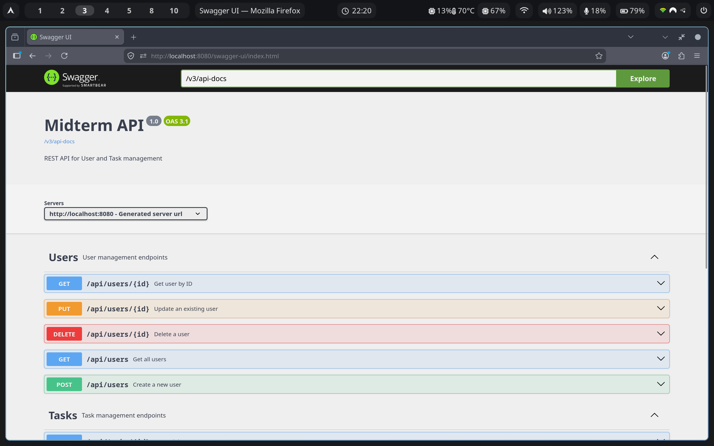
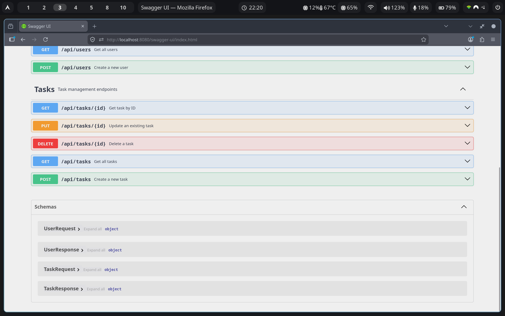
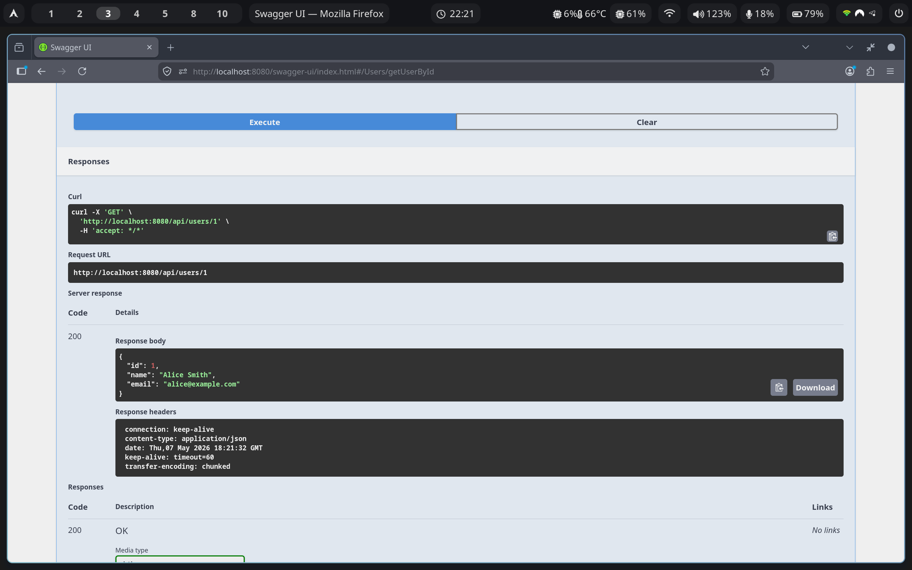
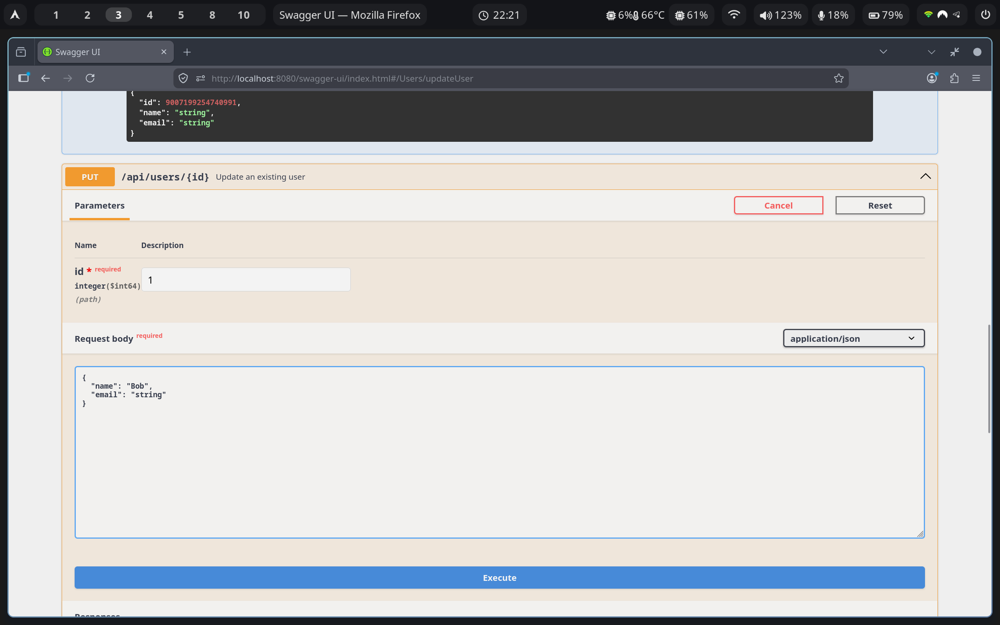
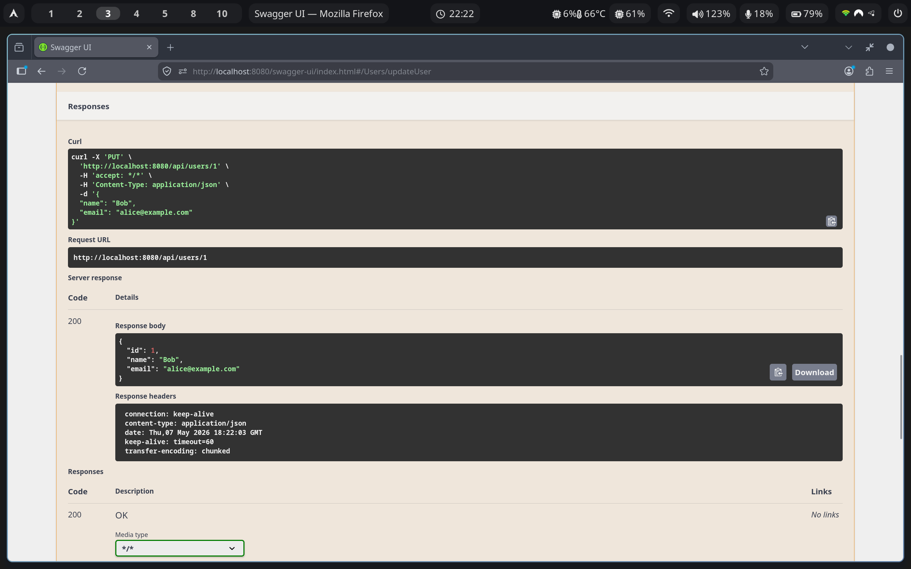

# Spring Boot Midterm Project

REST API for User and Task management — built with Spring Boot, Spring Data JPA, H2, and Swagger UI.

## Tech Stack

- Java 21 / Spring Boot 3.4.4
- Maven
- Spring Data JPA + H2 (in-memory)
- Bean Validation
- SpringDoc OpenAPI (Swagger UI)

## Quick Start

```bash
mvn spring-boot:run
```

The app starts at `http://localhost:8080`.

## API Endpoints

### Users

| Method | Path               | Description      |
|--------|--------------------|------------------|
| POST   | `/api/users`       | Create a user    |
| GET    | `/api/users`       | Get all users    |
| GET    | `/api/users/{id}`  | Get user by ID   |
| PUT    | `/api/users/{id}`  | Update a user    |
| DELETE | `/api/users/{id}`  | Delete a user    |

### Tasks

| Method | Path               | Description      |
|--------|--------------------|------------------|
| POST   | `/api/tasks`       | Create a task    |
| GET    | `/api/tasks`       | Get all tasks    |
| GET    | `/api/tasks/{id}`  | Get task by ID   |
| PUT    | `/api/tasks/{id}`  | Update a task    |
| DELETE | `/api/tasks/{id}`  | Delete a task    |

## Swagger UI

Open [http://localhost:8080/swagger-ui.html](http://localhost:8080/swagger-ui.html) to explore and test all endpoints.

### Screenshot — Swagger Overview



### Screenshot — Tasks & DTO Schemas



### Screenshot — Get User by ID



### Screenshots — Update User (PUT)

Request:


Response:


## H2 Console

Open [http://localhost:8080/h2-console](http://localhost:8080/h2-console) — JDBC URL: `jdbc:h2:mem:midterm`

## Validation

- User name: `@NotBlank`, `@Size(min=2, max=100)`
- User email: `@NotBlank`, `@Email`
- Task title: `@NotBlank`, `@Size(min=2, max=150)`
- Task description: `@Size(max=1000)`
- Task completed & userId: `@NotNull`

Invalid input returns HTTP 400 with field-level error details. Missing resources return HTTP 404.

## Tests

```bash
mvn test
```

16 integration tests covering CRUD operations, validation errors (400), missing resources (404), and duplicate email handling.
